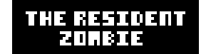
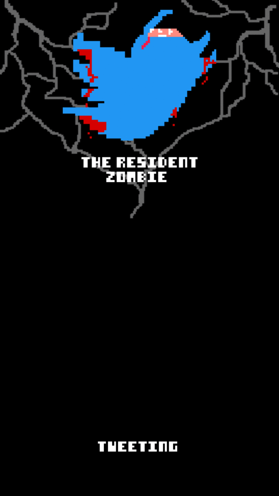

# The Resident Zombie



> The project was not finalized, unfortunately, because the backend was turned off, but it contains some codes that may come to help you! Any questions just call me.

## Getting Started

Hello survivor, I hope things are normal. It is the year 2020 and many things have happened. a pandemic took over the world and people started to behave strangely.

## Features in TRZ
- Contact list with localdb
- Scan and Generate QRCode
- User registration location.
- Translate EN-US/PT-BR
- Pixel UI
- Clean Archicteture
- Clean Code


## Installation
- You will need to have the [Flutter](https://flutter.dev/docs/get-started/install) set up on your computer
- In the project console, place the commands.

```shell
// code in the project console

$ flutter pub get
$ flutter pub run build_runner watch --delete-conflict-outputs
```

> It's so easy, right?

I thank you for the opportunity and hope you like it, even though everything has not been implemented.
